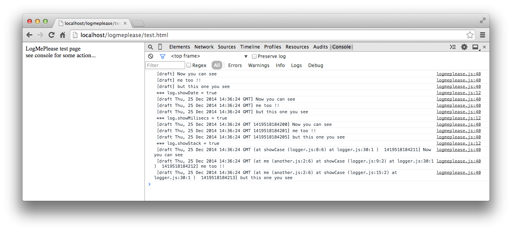

logmeplease
===========

javascript logger with filter

Use to avoid tons of log messages in the console :)
Add filters to show only logs that matches with the filter.

How to use
==========

1. add the logmeplease to your page
```javascript
<script src="logmeplease.js"></script>
```

2. create the logger object
```javascript
var log = new LogMePlease('draft');
```

3. add the filters
```javascript
log.add('another.js');
```

4. log it!
```javascript
log.debug('please show me');
```

Sample
======
